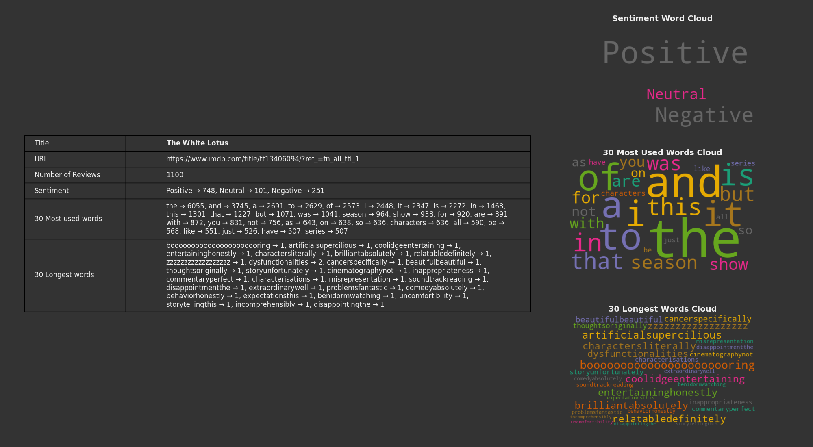
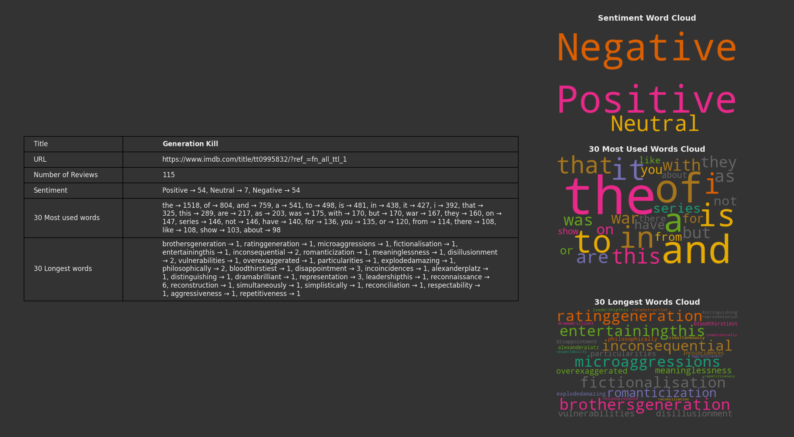
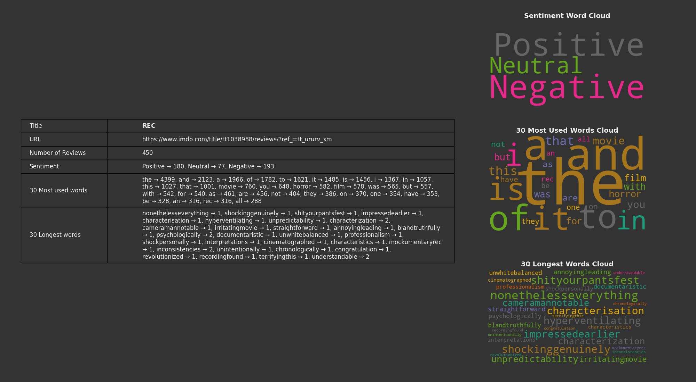

# Natural Language Processing for IMDb Reviews

This project fetches and analyzes IMDb reviews for a given movie or TV show. It performs sentiment analysis, extracts the most frequently used and longest words, and generates visual reports including word clouds.

## Project Structure

- `run_analysis.py`: The main script to run the analysis.
- `fetch_reviews.py`: Contains the `fetch_reviews` function to fetch all reviews or fetch to a specified limit of reviews from IMDb.
- `process_reviews.py`: Contains the `analyze_sentiment` and `extract_words` functions to analyze sentiment and extract words from the reviews.
- `generate_report.py`: Contains the `plot_final_report` function to generate and display the final report with word clouds.

## Analysis Functions

The following functions are implemented in `process_reviews.py`:

- `analyze_sentiment(reviews)`: Analyzes the sentiment of the reviews and returns a breakdown of positive, neutral, and negative sentiments.
  - This function uses the VADER (Valence Aware Dictionary and sEntiment Reasoner) sentiment analysis tool to evaluate the sentiment of each review. It returns a dictionary with the counts of positive, neutral, and negative sentiments.

- `extract_words(reviews)`: Extracts the most frequently used and longest words from the reviews.
  - This function tokenizes the reviews into words, filters out non-alphabetic words, and returns the 30 most frequently used words and the 30 longest words.

## How to Run

1. Clone the repository to your local machine.
2. Ensure you have Python and the required libraries installed. You can install the required libraries using:
    ```sh
    pip install wordcloud matplotlib nltk selenium beautifulsoup4
    ```
3. Run the main script with the IMDb URL and an optional limit of reviews to fetch:
    ```sh
    python run_analysis.py "https://www.imdb.com/title/tt13406094/reviews/?ref_=tt_ururv_sm" --limit 500
    ```

    - The `url` argument is required and should be the IMDb URL of the movie/TV show or the IMDb review page.
    - The `--limit` argument is optional and specifies the limit of reviews to fetch. The default value is 1000. Use `-1` to fetch all reviews.
    - *Note: Use the `-h` or `--help` flag to display all available options.*


## Example Outputs

After running the main script, you will see the analysis of the IMDb reviews, including sentiment breakdown, most used words, longest words, and word clouds.
Below are some example outputs:

#### Full Review Analysis
Command: `run_analysis.py https://www.imdb.com/title/tt13406094/?ref_=fn_all_ttl_1 --limit -1`



#### Standard Review Analysis
Command: `run_analysis.py https://www.imdb.com/title/tt0995832/?ref_=fn_all_ttl_1`



#### Limited Review Analysis
Command: `run_analysis.py https://www.imdb.com/title/tt1038988/reviews/?ref_=tt_ururv_sm --limit 450`



## License

This project is licensed under the MIT License. See the [LICENSE](LICENSE) file for details.

## Acknowledgments

- The IMDb reviews are fetched from the IMDb website. This project is an implementation of natural language processing techniques to analyze the reviews.